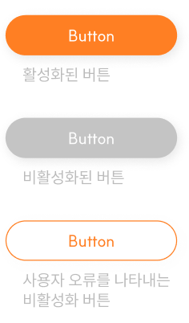

# JJUPBAK Design System
## Getting Started
- [Button](#button)
    - [JjButton](#jjbutton)
    - [JjIconButton](#jjiconbutton)
    - [JjChipButton](#jjchipbutton)
    - [JjPlusButton](#jjplusbutton)
    - [JjTrendButton](#jjtrendbutton)
    - [JjMapButton](#jjmapbutton)

## Button
! Button Design Component example


### JjButton


- XML Code
```kotlin
<com.android.jj_design.button.JjButton
    android:id="@+id/jj_button"
    android:layout_width="wrap_content"
    android:layout_height="wrap_content"
    app:jjText="1234"
    app:jjTextColor="@color/color_white"/>
```
- Programmatically Code
    - Enabled Button   
    
    ```kotlin
    binding.jjButton.isEnabled = true
    ```
    - Disabled Button   
    
    ```kotlin
    binding.jjButton.isEnabled = true
    ```
    - Error Button   
    
    ```kotlin
    binding.jjButton.setErrorBackground()
    ```

### JjIconButton


- XML Code
```kotlin
<com.android.jj_design.button.JjIconButton
    android:layout_width="wrap_content"
    android:layout_height="wrap_content"
    app:jjIconText="리뷰하기"
    app:jjIconTextColor="@color/color_666666"
    app:jjIconDrawableStart="@drawable/icon_pencil"/>
```

### JjChipButton


- XML Code
```kotlin
<com.android.jj_design.button.JjChipButton
    android:id="@+id/jj_chip_button"
    android:layout_width="wrap_content"
    android:layout_height="wrap_content"
    app:jjChipType="Confirm"/>
    // Delete, Confirm, Requested, Follow, Following
```

- Programmatically Code (use jjChipType)
    ```kotlin
    binding.jjChipButton.setChipItemType(Confirm)
    ```

### JjPlusButton


- XML Code
```kotlin
<com.android.jj_design.button.JjPlusButton
    android:layout_width="wrap_content"
    android:layout_height="wrap_content"/>
```

### JjTrendButton

- XML Code
```kotlin
<com.android.jj_design.button.JjTrendButton
    android:id="@+id/jj_trend_button"
    android:layout_width="wrap_content"
    android:layout_height="wrap_content"/>
```

- Programmatically Code
    - Enabled Trend Button   
    
        ```kotlin
        binding.jjTrendButton.isEnabled = true
        ```

    - Disabled Trend Button   
    
        ```kotlin
        binding.jjTrendButton.isEnabled = false
        ```


### JjMapButton


- XML Code
```kotlin
<com.android.jj_design.button.JjMapButton
    android:id="@+id/jj_map_button"
    android:layout_width="wrap_content"
    android:layout_height="wrap_content"
    android:layout_marginTop="10dp"
    app:jjMapType="Add"/>
    // Add, Minus, Position
```

- Programmatically Code
```kotlin
binding.jjMapButton.setJjMapType(Add) // Minus, Position
```